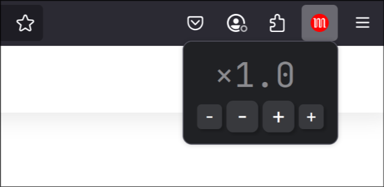

# Monospeed
Firefox extension to set video speed once, have it remembered and applied everywhere.

Available on Firefox Add-Ons, might look different than intented on other systems:  
https://addons.mozilla.org/de/firefox/addon/monospeed/

